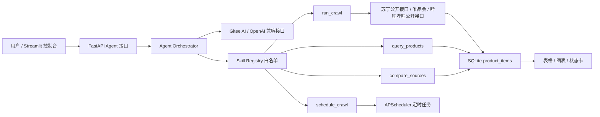

# 数码电商 Agent Skill 调度 Demo 中文说明

## 1. 项目简介

本项目是 Group5《Python 数据采集》期末项目的真实数据版 Demo，主题为“数码电商精细化分析”。系统采用 **FastAPI + Streamlit + SQLite + APScheduler + Agent Skills** 的工程结构，实现从自然语言指令到爬虫调度、数据查询、平台对比和可视化展示的闭环。

当前版本按“不使用样例，只使用真实数据”的要求设计：系统启动后数据库为空，只有真实抓取或授权真实数据文件解析成功后才会写入 SQLite。

## 2. 核心口径

- 苏宁、唯品会、哔哩哔哩统一写入 SQLite，评论正文单独保存到评论库。
- 苏宁从公开搜索页获取商品入口和评价数量，从公开价格接口获取价格，从公开评价接口只提取标签字段。
- 哔哩哔哩根据 ZOL 手机/笔记本型号定向搜索视频，抓取视频标题、BV 号和视频下方公开评论。
- ZOL 保留为手机、笔记本电脑型号参考源，本次不生成样例数据。

## 3. 系统架构



## 4. 目录结构

```text
group5/
├── agent/
│   ├── orchestrator.py      # Agent 指令解析：tool calling / JSON fallback
│   └── skills.py            # 白名单 Skill 注册与执行
├── api/
│   └── main.py              # FastAPI 后端接口
├── jobs/
│   └── scheduler.py         # APScheduler 定时任务
├── spiders/
│   ├── suning_spider.py     # 苏宁真实数据爬虫
│   ├── bilibili_spider.py   # 哔哩哔哩视频和评论爬虫
│   ├── vip_spider.py        # 唯品会真实数据爬虫
│   └── zol_spider.py        # ZOL 可选型号参考源
├── storage/
│   └── db.py                # SQLite 初始化、查询和聚合
├── tests/
│   └── test_live_mode.py    # 真实数据模式核心流程测试
├── streamlit_app.py         # Streamlit 控制台
├── requirements.txt
└── README.md
```

## 5. SQLite 核心字段

| 字段 | 含义 |
| --- | --- |
| `source` | 数据来源：`suning`、`vip`、`bilibili`、`zol` |
| `keyword` | 商品关键词 |
| `title` | 商品标题或 B 站视频标题 |
| `price` | 商品价格 |
| `merchant` | 商家名称或 B 站 BV 号 |
| `comment_count` | 评论数量 |
| `rank` | 可选排行字段 |
| `crawled_at` | 抓取时间 |

## 6. Agent Skills

| Skill | 功能 |
| --- | --- |
| `run_crawl` | 手动触发一个或多个数据源爬虫，并写入 SQLite |
| `schedule_crawl` | 创建周期性爬虫任务 |
| `query_products` | 按关键词和来源查询商品数据 |
| `compare_sources` | 聚合比较苏宁易购、唯品会、哔哩哔哩、中关村在线数据 |
| `job_status` | 查看当前定时任务和数据库状态 |

系统优先尝试 Gitee AI / OpenAI 兼容 tool calling。模型或接口不稳定时，自动降级为本地 JSON action 解析。两种方式都不会生成样例数据。

## 7. 哔哩哔哩真实数据源

B 站爬虫不需要登录。代码会先访问首页和搜索页获取基础 cookie，再访问公开搜索和评论接口。

命令示例：

```powershell
python spiders/bilibili_spider.py
python spiders/bilibili_spider.py "iPhone 15" --limit 30
python spiders/bilibili_spider.py --category notebook --limit 150
```

当前代码使用的接口：

- 搜索列表：`https://api.bilibili.com/x/web-interface/search/type`。
- 视频信息：`https://api.bilibili.com/x/web-interface/view`。
- 评论列表：`https://api.bilibili.com/x/v2/reply`。

## 8. 运行方法

安装依赖：

```powershell
python -m pip install -r requirements.txt
```

启动 FastAPI：

```powershell
python -m uvicorn api.main:app --reload --port 8000
```

启动 Streamlit：

```powershell
python -m streamlit run streamlit_app.py
```

默认访问地址：

```text
http://127.0.0.1:8000/health
http://127.0.0.1:8501
```

## 9. 演示流程建议

1. 打开 Streamlit 控制台，展示 FastAPI、Scheduler、SQLite、Gitee AI 状态。
2. 说明数据库初始为空，不使用 seed 样例数据。
3. 执行自然语言指令：

```text
每30分钟抓取 手机 苏宁和哔哩哔哩价格、商家、评论数量和具体评论
```

4. 点击”设置定时”，展示苏宁、哔哩哔哩两个定时任务。
5. 点击”手动抓取”，展示真实数据入库。
6. 展示表格中的平台、标题、价格、商家/BV 号、评论数量和更新时间。
7. 展示最低价对比图和数据源概览。

## 10. 测试方法

```powershell
python -m pytest -q
```

当前测试覆盖：

- SQLite 是否在无 seed 情况下保持空库。
- Agent fallback 是否能把自然语言指令路由到 `schedule_crawl`。
- B 站标题清洗是否能去掉搜索高亮 HTML。
- SQLite 查询结果不再暴露 `comment_text`。
- 重复抓取同一来源、同一标题、同一商家/BV 号时不会重复插入。

## 11. 合规说明

项目不绕过验证码、不破解签名、不抓取隐私数据、不强行访问受限接口。唯品会、苏宁易购、哔哩哔哩都应在答辩时说明 robots.txt、网站规则、反爬处理和数据使用边界。

本项目的真实数据策略：

- 苏宁：公开搜索页 + 公开价格接口 + 公开评价接口中的标签字段。
- 哔哩哔哩：公开搜索接口 + 公开视频信息接口 + 公开视频评论接口。
- 不使用 seed 样例，不把模拟数据伪装成真实数据。
